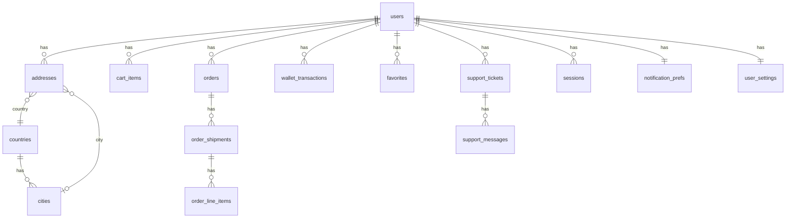

# خطة ربط تطبيق Zayer بـ API + Laravel + قاعدة بيانات + لوحة إدارة

## 1. ملخص الـ API Endpoints المطلوبة (من التطبيق)

التطبيق يستخدم حالياً mock في معظم الـ repositories والـ providers. الـ endpoints التالية مطلوبة حسب الملفات في المشروع:

### 1.1 المصادقة (Auth)

| Method | Path                        | الوصف                                     | مرجع في التطبيق                                           |
| ------ | --------------------------- | ----------------------------------------- | --------------------------------------------------------- |
| POST   | `/api/auth/register`        | تسجيل (هاتف، اسم، كلمة مرور، دولة، مدينة) | [register_screen](lib/features/auth/register_screen.dart) |
| POST   | `/api/auth/login`           | دخول (هاتف + كلمة مرور)                   | [login_screen](lib/features/auth/login_screen.dart)       |
| POST   | `/api/auth/verify-otp`      | التحقق من OTP (تسجيل/استعادة)             | OTP screen, mode=signup                                   |
| POST   | `/api/auth/forgot-password` | طلب إعادة تعيين كلمة المرور               | Forgot password                                           |
| POST   | `/api/auth/logout`          | تسجيل خروج                                | Security / Active sessions                                |
| POST   | `/api/auth/refresh`         | تجديد التوكن (إن وُجد)                    | -                                                         |

### 1.2 التكوين العام (Bootstrap / App Config)

| Method | Path                                         | الوصف                                                 | مرجع                                                                                                                                          |
| ------ | -------------------------------------------- | ----------------------------------------------------- | --------------------------------------------------------------------------------------------------------------------------------------------- |
| GET    | `/api/config/bootstrap` أو `/api/app-config` | theme, splash, onboarding, markets (دول، متاجر مميزة) | [app_config_repository](lib/core/config/app_config_repository.dart), [app_bootstrap_config](lib/core/config/models/app_bootstrap_config.dart) |

**هيكل الاستجابة المتوقع:** theme (primary_color, background_color, text_color, muted_text_color), splash (logo_url, title_en/ar, subtitle_en/ar, progress_text_en/ar), onboarding (array: image_url, title_en/ar, description_en/ar), markets (title, subtitle, countries[], featured_stores[]).

### 1.3 المستخدم والبروفايل (Me)

| Method   | Path                               | الوصف                                                                            | مرجع                                                                                                                                                       |
| -------- | ---------------------------------- | -------------------------------------------------------------------------------- | ---------------------------------------------------------------------------------------------------------------------------------------------------------- |
| GET      | `/api/me`                          | البروفايل (displayName, fullLegalName, dateOfBirth, primaryAddress, verified, …) | [profile_repository](lib/features/profile/repositories/profile_repository.dart), [user_profile_model](lib/features/profile/models/user_profile_model.dart) |
| PATCH    | `/api/me`                          | تحديث الاسم، تاريخ الميلاد، الاسم المعروض                                        | نفس الملف                                                                                                                                                  |
| POST     | `/api/me/avatar`                   | رفع صورة البروفايل                                                               | ProfileRepository.uploadAvatar                                                                                                                             |
| GET      | `/api/me/compliance`               | حالة الامتثال (KYC/ID)                                                           | getCompliance                                                                                                                                              |
| GET      | `/api/me/addresses`                | قائمة العناوين                                                                   | [address_repository](lib/features/profile/repositories/address_repository.dart)                                                                            |
| POST     | `/api/me/addresses`                | إضافة عنوان                                                                      | saveAddress (بدون id)                                                                                                                                      |
| PATCH    | `/api/me/addresses/:id`            | تحديث عنوان + set default                                                        | saveAddress (مع id), setDefaultAddress                                                                                                                     |
| GET      | `/api/countries`                   | قائمة الدول للعناوين                                                             | getCountries                                                                                                                                               |
| GET      | `/api/cities`                      | مدن حسب الدولة (query: country_id)                                               | getCities(countryId)                                                                                                                                       |
| GET      | `/api/me/notification-preferences` | تفضيلات الإشعارات                                                                | [notification_prefs_model](lib/features/notifications/models/notification_prefs_model.dart)                                                                |
| PATCH    | `/api/me/notification-preferences` | تحديث التفضيلات                                                                  | notification_prefs_providers                                                                                                                               |
| GET      | `/api/me/settings`                 | إعدادات المستخدم (لغة، عملة، مستودع افتراضي، توحيد شحن، تأمين تلقائي)            | [settings_providers](lib/features/settings/providers/settings_providers.dart), [app_settings_model](lib/features/settings/models/app_settings_model.dart)  |
| PATCH    | `/api/me/settings`                 | حفظ الإعدادات                                                                    | SettingsOverridesNotifier                                                                                                                                  |
| GET      | `/api/me/sessions`                 | الجلسات النشطة                                                                   | [active_sessions_screen](lib/features/security/active_sessions_screen.dart) (SessionInfo)                                                                  |
| DELETE   | `/api/me/sessions/:id`             | إنهاء جلسة                                                                       | -                                                                                                                                                          |
| POST     | `/api/me/change-password`          | تغيير كلمة المرور                                                                | Change password screen                                                                                                                                     |
| GET/POST | `/api/me/two-factor`               | تفعيل/تعطيل 2FA                                                                  | Two factor screen                                                                                                                                          |
| GET      | `/api/me/recent-activity`          | النشاط الأخير (تسجيلات دخول، تغييرات)                                            | Recent activity screen                                                                                                                                     |

### 1.4 السلة (Cart)

| Method | Path                             | الوصف                                                                                             | مرجع                                                                                                                                     |
| ------ | -------------------------------- | ------------------------------------------------------------------------------------------------- | ---------------------------------------------------------------------------------------------------------------------------------------- |
| GET    | `/api/cart` أو `/api/cart/items` | عناصر السلة للمستخدم                                                                              | [cart_repository](lib/features/cart/repositories/cart_repository.dart) — التطبيق يخزن محلياً ويُرسل POST فقط حالياً                      |
| POST   | `/api/cart/items`                | إضافة عنصر (body: url, name, price, quantity, currency, image_url, store_key, country, source, …) | [api_config](lib/core/network/api_config.dart) kCartItemsPath, [cart_item_model](lib/features/cart/models/cart_item_model.dart) toJson() |
| PATCH  | `/api/cart/items/:id`            | تحديث الكمية                                                                                      | updateQuantity                                                                                                                           |
| DELETE | `/api/cart/items/:id`            | حذف عنصر                                                                                          | removeItem                                                                                                                               |
| DELETE | `/api/cart`                      | تفريغ السلة                                                                                       | clear                                                                                                                                    |

**ملاحظة:** نموذج CartItem يتضمن: id, productUrl, name, unitPrice, quantity, currency, imageUrl, storeKey, storeName, productId, country, weight, dimensions, source (webview  paste_link), review_status (pending_review, reviewed, rejected), shipping_cost.

### 1.5 الطلبات (Orders)

| Method | Path              | الوصف                                        | مرجع                                                                                                                                |
| ------ | ----------------- | -------------------------------------------- | ----------------------------------------------------------------------------------------------------------------------------------- |
| GET    | `/api/orders`     | قائمة الطلبات (مع فلترة/ترتيب اختياري)       | [orders_providers](lib/features/orders/providers/orders_providers.dart), [order_model](lib/features/orders/models/order_model.dart) |
| GET    | `/api/orders/:id` | تفاصيل طلب واحد (شحنات، عناصر، تتبع، فاتورة) | order_detail_screen, order_tracking_screen, order_invoice_screen                                                                    |

**هيكل Order:** id, origin (multi_origin  turkey  usa), status (in_transit  delivered  cancelled), order_number, placed_date, delivered_on, total_amount, refund_status, estimated_delivery, shipping_address, shipments[], price_lines[], consolidation_savings, payment_method_label, payment_method_last_four, invoice_issue_date, transaction_id. كل shipment: country_code, country_label, shipping_method, eta, items[], tracking_events[], subtotal, shipping_fee, customs_duties, إلخ.

### 1.6 الدفع والتحقق (Checkout)

| Method | Path                    | الوصف                                                        | مرجع                                                                                                                                                                          |
| ------ | ----------------------- | ------------------------------------------------------------ | ----------------------------------------------------------------------------------------------------------------------------------------------------------------------------- |
| GET    | `/api/checkout/review`  | مراجعة الطلب (عنوان، شحنات مجمعة، توفير، رصيد محفظة، إجمالي) | [checkout_review_providers](lib/features/checkout/providers/checkout_review_providers.dart), [checkout_review_model](lib/features/checkout/models/checkout_review_model.dart) |
| POST   | `/api/checkout/confirm` | تأكيد الطلب (مع خيار استخدام رصيد المحفظة)                   | checkoutWalletEnabledProvider                                                                                                                                                 |

### 1.7 المحفظة (Wallet)

| Method | Path                                                 | الوصف                                                    | مرجع                                                                                                                                  |
| ------ | ---------------------------------------------------- | -------------------------------------------------------- | ------------------------------------------------------------------------------------------------------------------------------------- |
| GET    | `/api/wallet`                                        | الرصيد (available, pending, promo)                       | [wallet_model](lib/features/wallet/models/wallet_model.dart), [wallet_providers](lib/features/wallet/providers/wallet_providers.dart) |
| GET    | `/api/wallet/transactions` أو `/api/wallet/activity` | حركات المحفظة (مع فلتر: all, refunds, payments, top_ups) | walletTransactionsProvider                                                                                                            |
| POST   | `/api/wallet/top-up`                                 | تعبئة المحفظة (مبلغ + طريقة دفع)                         | [top_up_wallet_screen](lib/features/wallet/top_up_wallet_screen.dart)                                                                 |

### 1.8 المفضلة (Favorites)

| Method | Path                 | الوصف              | مرجع                                                                                                                                                |
| ------ | -------------------- | ------------------ | --------------------------------------------------------------------------------------------------------------------------------------------------- |
| GET    | `/api/favorites`     | قائمة المفضلة      | [favorites_providers](lib/features/favorites/providers/favorites_providers.dart), [favorite_item](lib/features/favorites/models/favorite_item.dart) |
| POST   | `/api/favorites`     | إضافة منتج للمفضلة | -                                                                                                                                                   |
| DELETE | `/api/favorites/:id` | إزالة من المفضلة   | -                                                                                                                                                   |

**نموذج FavoriteItem:** id, source_key, source_label, title, price, currency, price_drop, tracking_on, stock_status, stock_label, image_url.

### 1.9 الدعم (Support)

| Method | Path                                           | الوصف                                                 | مرجع                                                                                                                                               |
| ------ | ---------------------------------------------- | ----------------------------------------------------- | -------------------------------------------------------------------------------------------------------------------------------------------------- |
| GET    | `/api/support/inbox` أو `/api/support/tickets` | قائمة التذاكر + عناصر مرتبطة بطلبات                   | [support_repository](lib/features/support/repositories/support_repository.dart), [support_models](lib/features/support/models/support_models.dart) |
| GET    | `/api/support/tickets/:id`                     | تفاصيل تذكرة + رسائل + أحداث                          | getTicketDetail                                                                                                                                    |
| POST   | `/api/support/tickets/:id/messages`            | إرسال رسالة في التذكرة                                | -                                                                                                                                                  |
| POST   | `/api/support/requests`                        | إنشاء طلب دعم (order_id, issue_type, details, مرفقات) | submitSupportRequest                                                                                                                               |

### 1.10 الإشعارات (Notifications)

| Method | Path                          | الوصف                                                    | مرجع                                                                                                                                                                  |
| ------ | ----------------------------- | -------------------------------------------------------- | --------------------------------------------------------------------------------------------------------------------------------------------------------------------- |
| GET    | `/api/notifications`          | قائمة الإشعارات (مع فلتر: all, orders, shipments, promo) | [notifications_list_screen](lib/features/notifications/notifications_list_screen.dart), [notification_item](lib/features/notifications/models/notification_item.dart) |
| PATCH  | `/api/notifications/:id/read` | تعليم كمقروء                                             | -                                                                                                                                                                     |

### 1.11 الصفحة الرئيسية والأسواق (Home / Markets)

| Method | Path                                          | الوصف                                                            | مرجع                                                                            |
| ------ | --------------------------------------------- | ---------------------------------------------------------------- | ------------------------------------------------------------------------------- |
| GET    | `/api/home/promo-banners` أو دمج في bootstrap | بانرات العروض (id, label, title, cta_text, image_url, deep_link) | [home_providers](lib/features/home/providers/home_providers.dart) PromoBanner   |
| GET    | `/api/home/markets` أو من bootstrap           | أسواق + عدد المتاجر (يمكن اشتقاقه من المتاجر)                    | homeMarketsProvider, MarketItem                                                 |
| GET    | `/api/home/stores` أو من bootstrap            | متاجر شائعة (id, name, category, logo_url, market_id)            | homeStoresProvider, StoreItem                                                   |
| GET    | `/api/warehouses`                             | قائمة المستودعات (للإعدادات + اختيار المستودع الافتراضي)         | [default_warehouse_screen](lib/features/settings/default_warehouse_screen.dart) |

### 1.12 استيراد المنتج من الرابط (الباك إند + الذكاء الاصطناعي)

**القرار:** الباك إند هو المسؤول عن جلب **كل** بيانات المنتج من الرابط باستخدام الذكاء الاصطناعي. التطبيق يرسل الرابط فقط ويستقبل البيانات الجاهزة (بدون WebView أو استخراج من داخل التطبيق).

| Method | Path                            | الوصف                                                                                                                                                                                                                                                 | مرجع في التطبيق                                                                                                                                                                                                                                                                   |
| ------ | ------------------------------- | ----------------------------------------------------------------------------------------------------------------------------------------------------------------------------------------------------------------------------------------------------- | --------------------------------------------------------------------------------------------------------------------------------------------------------------------------------------------------------------------------------------------------------------------------------- |
| POST   | `/api/products/import-from-url` | إرسال رابط صفحة المنتج؛ الباك إند يجلب HTML/المحتوى ويستخدم **AI** لاستخراج: الاسم، السعر، العملة، الصورة، المتجر، الدولة، الوزن، الأبعاد، حالة التوفر، إلخ. الاستجابة بنفس هيكل بيانات المنتج الذي يحتاجه التطبيق (للعرض ثم إضافة للسلة أو المفضلة). | [product_link_import_repository](lib/features/paste_link/repositories/product_link_import_repository.dart), [product_import_result](lib/features/paste_link/models/product_import_result.dart), [confirm_product_screen](lib/features/product_import/confirm_product_screen.dart) |

**Body (طلب):** `{ "url": "https://..." }` (واختياري: `store_key` إذا عُرِف المصدر مسبقاً).

**استجابة متوقعة (snake_case):** name, price, currency, store_name, country, image_url, canonical_url, weight, dimensions (أو length/width/height/dimension_unit)، وكل حقول [CartItem](lib/features/cart/models/cart_item_model.dart) / [ProductImportResult](lib/features/paste_link/models/product_import_result.dart) التي يحتاجها التطبيق.

**تنفيذ في الباك إند (Laravel):**

- **جلب المحتوى:** استخدام HTTP client (Guzzle) لطلب الصفحة (مع User-Agent و headers شبيهة بمتصفح إن لزم لتجنب الحظر)، أو استخدام خدمة **headless browser / scraping** إذا الموقع يعتمد على JavaScript.
- **الاستخراج بالذكاء الاصطناعي:** إرسال HTML (أو جزء منه) أو الـ URL إلى نموذج لغة (مثل OpenAI GPT-4o، Claude، أو نموذج مخصص) مع **prompt** يطلب استخراج حقول المنتج بشكل منظم (JSON). بديل: استخدام **Structured Output / JSON mode** من الـ API لضمان استجابة قابلة للتحويل مباشرة إلى نموذج التطبيق.
- **التخزين المؤقت (اختياري):** cache النتيجة حسب URL (مع TTL) لتقليل استدعاءات AI وتكلفة تكرار نفس الرابط.
- **الأمان والتحقق:** التحقق من أن الرابط لصفحة منتج مسموح (نفس قائمة المتاجر/الدومينات المدعومة في التطبيق)، وتحديد معدل الطلبات (rate limit) لكل مستخدم لتجنب إساءة الاستخدام وتقليل التكلفة.

بعد تنفيذ هذا الـ endpoint، التطبيق (Paste Link + تأكيد المنتج) يستدعي `POST /api/products/import-from-url` بدلاً من استخدام WebView أو `ProductLinkImportRepositoryMock`، ثم يعرض النتيجة ويسمح بإضافة المنتج للسلة أو المفضلة.

---

## 2. هيكل Laravel API المقترح

- **Laravel 11** (أو 10) مع **Sanctum** للمصادقة (Bearer token للجوال).
- هيكل المجلدات:
  - `app/Http/Controllers/Api/` — AuthController, MeController, AddressController, CartController, OrderController, CheckoutController, WalletController, FavoritesController, SupportController, NotificationsController, ConfigController, **ProductImportController** (استيراد المنتج من الرابط بالـ AI).
  - `app/Services/` — **ProductImportService** (جلب الصفحة + استدعاء AI لاستخراج بيانات المنتج)، واختياري: **AiExtractionService** أو تكامل مع OpenAI/Claude API.
  - `app/Models/` — User, Address, Cart, CartItem, Order, OrderShipment, OrderLineItem, Wallet, WalletTransaction, Favorite, SupportTicket, SupportMessage, Notification, NotificationPrefs, Session.
  - `app/Http/Resources/` — تحويل النماذج إلى JSON (snake_case للتوافق مع التطبيق).
- **Routes:** كل الـ endpoints أعلاه تحت `Route::prefix('api')->middleware('auth:sanctum')->group(...)` ما عدا: register, login, verify-otp, forgot-password, و GET config/bootstrap (يمكن عام أو مع لغة).
- **Validation:** Form Requests لكل POST/PATCH.
- **CORS:** تفعيل للدومين/تطبيق Flutter.

---

## 3. قاعدة البيانات (Database)

الجداول المقترحة (بدون تفاصيل كل عمود؛ يمكن توسيعها لاحقاً):

### الجداول الرئيسية

- **users** — id, phone, email nullable, password, full_name, display_name, date_of_birth, avatar_url, verified, last_verified_at, 2fa_enabled, 2fa_secret, locale, created_at, updated_at.
- **addresses** — id, user_id, country_id, city_id, nickname, address_type (home/office/other), area_district, street_address, building_villa_suite, address_line (مجمّع أو مفرد)، phone, is_default, is_verified, is_residential, lat, lng, linked_to_active_order, is_locked, timestamps.
- **countries** — id, code, name, flag_emoji.
- **cities** — id, country_id, name (أو code).
- **cart_items** — id, user_id, product_url, name, unit_price, quantity, currency, image_url, store_key, store_name, product_id, country, weight, weight_unit, length, width, height, dimension_unit, source, review_status (pending_review/reviewed/rejected), shipping_cost, synced_at, timestamps.
- **orders** — id, user_id, order_number, origin (enum), status (enum), placed_at, delivered_at, total_amount, currency, refund_status, estimated_delivery, shipping_address_id, consolidation_savings, payment_method_label, payment_method_last_four, invoice_issue_date, transaction_id, timestamps.
- **order_shipments** — id, order_id, country_code, country_label, shipping_method, eta, subtotal, shipping_fee, customs_duties, gross_weight_kg, dimensions, insurance_confirmed, status_tags (JSON أو جدول منفصل).
- **order_line_items** — id, order_shipment_id (أو order_id), name, store_name, sku, price, quantity, image_url, badges (JSON), weight_kg, dimensions, shipping_method.
- **order_tracking_events** — id, order_shipment_id, title, subtitle, icon (أو نوع), is_highlighted, sort_order.
- **order_price_lines** — id, order_id, label, amount, is_discount.
- **wallets** — id, user_id, available_balance, pending_balance, promo_balance, timestamps.
- **wallet_transactions** — id, wallet_id, type (payment/refund/top_up), title, amount (مع إشارة), subtitle, reference_type, reference_id, timestamps.
- **favorites** — id, user_id, source_key, source_label, title, price, currency, price_drop, tracking_on, stock_status, stock_label, image_url, product_url (اختياري), timestamps.
- **support_tickets** — id, user_id, order_id nullable, issue_type, subject, status, avg_response_time, timestamps.
- **support_ticket_events** — id, support_ticket_id, label, time (أو created_at).
- **support_messages** — id, support_ticket_id, user_id nullable (null = agent), is_from_agent, sender_name, body, image_url, timestamps.
- **notifications** — id, user_id, type (orders/shipments/promo), title, subtitle, time_ago أو created_at, read, important, action_label, action_route, timestamps.
- **notification_prefs** — user_id, push_enabled, email_enabled, sms_enabled, live_status_updates, quiet_hours_from, quiet_hours_to, ... (حسب NotificationPrefsModel).
- **user_settings** — user_id, language_code, currency_code, default_warehouse_id, default_warehouse_label, smart_consolidation_enabled, auto_insurance_enabled, ...
- **sessions** — id, user_id, device_name, location, last_active_at, client_info, token_hash (إن استخدمت جدول sessions مع Sanctum أو مخصص).
- **warehouses** — id, slug (مثل delaware_us), label (مثل "Delaware, US"), country_code, is_active.
- **app_config** أو جداول منفصلة:
  - **theme_config** — primary_color, background_color, text_color, muted_text_color (قيم افتراضية أو per-environment).
  - **splash_config** — logo_url, title_en, title_ar, subtitle_en, subtitle_ar, progress_text_en, progress_text_ar.
  - **onboarding_pages** — sort_order, image_url, title_en, title_ar, description_en, description_ar.
  - **market_countries** — code, name, flag_emoji, is_featured.
  - **featured_stores** — id (slug), name, description, logo_url, country_code, store_url, is_featured.
- **promo_banners** — id, label, title, cta_text, image_url, deep_link, sort_order, is_active, start_at, end_at.

يمكن استخدام Migrations لإنشاء الجداول وعلاقات Eloquent بينها.

---

## 4. لوحة الإدارة (Admin Panel) — صلاحيات كاملة والتحكم بالتطبيق

### 4.1 المصادقة والصلاحيات

- تسجيل دخول الأدمن (مثلاً guard `admin` مع جدول `admins` أو role على `users`).
- أدوار وصلاحيات (مثلاً **Spatie Laravel Permission**): Super Admin, Support, Operations, Content, إلخ.
- الصلاحيات تشمل: إدارة المستخدمين، الطلبات، التذاكر، المحتوى (config، بانرات، متاجر)، التقارير.

### 4.2 إدارة المحتوى والتكوين (التحكم الكامل بما يراه التطبيق)

- **Bootstrap / App Config:**
  - تحرير **Theme** (ألوان التطبيق).
  - تحرير **Splash** (شعار، عناوين/نصوص عربي وإنجليزي).
  - تحرير **Onboarding** (إضافة/حذف/ترتيب صفحات، صور، نصوص ثنائية اللغة).
  - تحرير **Markets:** دول (كود، اسم، علم)، متاجر مميزة (اسم، وصف، رابط، دولة، مميز أم لا).
- **بانرات العروض (Promo Banners):** إضافة/تعديل/حذف، ترتيب، فترة عرض، رابط/ديب لينك.
- **المستودعات (Warehouses):** إضافة/تعديل/حذف، تفعيل/إيقاف (لظهورها في إعدادات المستودع الافتراضي).
- **(اختياري) استيراد المنتج بالـ AI:** إعداد قائمة الدومينات/المتاجر المسموح استيراد المنتج منها؛ أو إعدادات مفتاح/نموذج الـ AI المستخدم في استخراج بيانات المنتج من الرابط.

### 4.3 إدارة المستخدمين

- قائمة مستخدمين (بحث، فلترة، ترتيب).
- عرض/تعديل بروفايل مستخدم (اسم، هاتف، تحقق، قفل حساب).
- عرض عناوين المستخدم، جلساته، إعداداته، تفضيلات الإشعارات.

### 4.4 الطلبات والسلة

- قائمة الطلبات (فلترة حسب الحالة، الأصل، تاريخ).
- عرض تفاصيل الطلب (شحنات، عناصر، تتبع، فاتورة).
- تغيير حالة الطلب (مثلاً in_transit → delivered)، إضافة أحداث تتبع.
- **مراجعة عناصر السلة (Cart item review):** عناصر بحالة `pending_review` (من التطبيق: خطر/قابل للكسر) — الموافقة أو الرفض (reviewed/rejected) حتى يتمكن المستخدم من الشحن.

### 4.5 المحفظة والمالية

- عرض أرصدة المستخدمين.
- سجل حركات المحفظة (تعريفات، استرداد، تعبئة).
- (اختياري) الموافقة على طلبات تعبئة إن وُجدت آلية موافقة.

### 4.6 الدعم (Support)

- قائمة التذاكر (حسب الحالة، المستخدم، الطلب).
- فتح تذكرة والرد برسائل (كـ Agent)؛ رفع مرفقات.
- تغيير حالة التذكرة (مفتوحة، قيد المعالجة، محلولة).
- ربط التذكرة بطلب معين.

### 4.7 الإشعارات والمحتوى الثانوي

- إرسال إشعارات (push/email) لمستخدم أو مجموعة (مثلاً حسب دور أو منطقة).
- (اختياري) إدارة قوالب الإيميل/الإشعارات من لوحة التحكم.

### 4.8 التقارير والإحصائيات (اختياري)

- لوحة رئيسية: عدد المستخدمين، الطلبات، الإيرادات، التذاكر المفتوحة.
- تقارير طلبات، مبيعات، مستودعات.

### 4.9 تقنيات مقترحة للوحة الإدارة

- **Laravel** كـ API للوحة أيضاً أو استخدام نفس المشروع.
- واجهة ويب: **Filament 3** (موصى به مع Laravel) أو **Laravel Nova** أو **Backpack** أو **Vue/React + Inertia** مع نفس الـ API.
- الـ Admin يعتمد على نفس قاعدة البيانات؛ الصلاحيات تمنع الوصول لـ routes المستخدم العادي وتسمح فقط بـ admin routes و CRUD على الجداول المطلوبة.

---

## 5. ترتيب التنفيذ المقترح

1. **قاعدة البيانات:** إنشاء migrations للجداول أعلاه + العلاقات.
2. **Laravel API — Auth:** register, login, verify-otp, forgot-password, logout + Sanctum.
3. **Config:** GET bootstrap (من جداول theme, splash, onboarding, markets, featured_stores).
4. **Me:** profile, addresses, countries/cities, notification prefs, settings, sessions, change-password, 2FA, recent-activity.
5. **Cart:** GET/POST/PATCH/DELETE items (ومراجعة الحالة من الأدمن لاحقاً).
6. **Orders:** list + detail (مع shipments, line items, tracking, price lines).
7. **Checkout:** review + confirm (إنشاء طلب من السلة، خصم محفظة إن وُجد).
8. **Wallet:** balance + transactions + top-up.
9. **Favorites, Support, Notifications:** CRUD حسب الـ endpoints أعلاه.
10. **استيراد المنتج بالـ AI:** تنفيذ `POST /api/products/import-from-url` — جلب المحتوى من الرابط، استخراج البيانات عبر نموذج لغة (AI)، إرجاع JSON متوافق مع التطبيق؛ إضافة rate limit وقائمة دومينات مسموحة؛ (اختياري) cache حسب URL.
11. **Admin Panel:** إعداد Filament (أو بديل)، صلاحيات، ثم إدارة Config، Users، Orders، Cart review، Support، ثم التقارير إن رغبت. (اختياري من لوحة الأدمن: إعداد قائمة المتاجر/الدومينات المسموح استيراد المنتج منها، أو إعدادات مفتاح API للـ AI.)

بعد ذلك ربط التطبيق Flutter بهذه الـ endpoints (استبدال الـ mock implementations في الـ repositories والـ providers بـ HTTP client مثل Dio مع base URL من [api_config](lib/core/network/api_config.dart)).