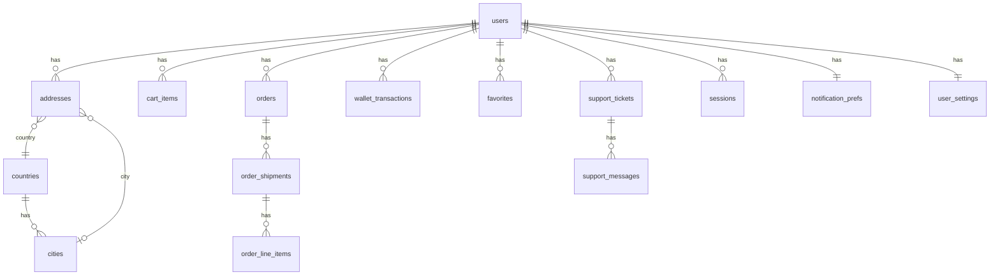

# خطة ربط تطبيق Zayer بـ API + Laravel + قاعدة بيانات + لوحة إدارة

ملخص كامل لـ API endpoints المطلوبة لربط التطبيق، مع Laravel API وقاعدة البيانات ولوحة إدارة بصلاحيات كاملة.

---

## 1. ملخص الـ API Endpoints المطلوبة (من التطبيق)

التطبيق يستخدم حالياً mock في معظم الـ repositories والـ providers. الـ endpoints التالية مطلوبة حسب الملفات في المشروع:

### 1.1 المصادقة (Auth)

| Method | Path                        | الوصف                                     | مرجع في التطبيق                                           |
| ------ | --------------------------- | ----------------------------------------- | --------------------------------------------------------- |
| POST   | `/api/auth/register`        | تسجيل (هاتف، اسم، كلمة مرور، دولة، مدينة) | lib/features/auth/register_screen.dart                     |
| POST   | `/api/auth/login`           | دخول (هاتف + كلمة مرور)                   | lib/features/auth/login_screen.dart                        |
| POST   | `/api/auth/verify-otp`      | التحقق من OTP (تسجيل/استعادة)             | OTP screen, mode=signup \| reset                           |
| POST   | `/api/auth/forgot-password` | طلب إعادة تعيين كلمة المرور               | Forgot password                                           |
| POST   | `/api/auth/logout`          | تسجيل خروج                                | Security / Active sessions                                |
| POST   | `/api/auth/refresh`         | تجديد التوكن (إن وُجد)                    | -                                                         |

### 1.2 التكوين العام (Bootstrap / App Config)

| Method | Path                                         | الوصف                                                 | مرجع                                                                 |
| ------ | -------------------------------------------- | ----------------------------------------------------- | -------------------------------------------------------------------- |
| GET    | `/api/config/bootstrap` أو `/api/app-config` | theme, splash, onboarding, markets (دول، متاجر مميزة) | lib/core/config/app_config_repository.dart, app_bootstrap_config     |

**هيكل الاستجابة المتوقع:** theme (primary_color, background_color, text_color, muted_text_color), splash (logo_url, title_en/ar, subtitle_en/ar, progress_text_en/ar), onboarding (array: image_url, title_en/ar, description_en/ar), markets (title, subtitle, countries[], featured_stores[]).

### 1.3 المستخدم والبروفايل (Me)

| Method   | Path                               | الوصف                                                                            | مرجع                    |
| -------- | ---------------------------------- | -------------------------------------------------------------------------------- | ----------------------- |
| GET      | `/api/me`                          | البروفايل (displayName, fullLegalName, dateOfBirth, primaryAddress, verified, …) | profile_repository      |
| PATCH    | `/api/me`                          | تحديث الاسم، تاريخ الميلاد، الاسم المعروض                                        | نفس الملف               |
| POST     | `/api/me/avatar`                   | رفع صورة البروفايل                                                               | ProfileRepository       |
| GET      | `/api/me/compliance`               | حالة الامتثال (KYC/ID)                                                           | getCompliance           |
| GET      | `/api/me/addresses`                | قائمة العناوين                                                                   | address_repository      |
| POST     | `/api/me/addresses`                | إضافة عنوان                                                                      | saveAddress             |
| PATCH    | `/api/me/addresses/:id`            | تحديث عنوان + set default                                                        | setDefaultAddress       |
| GET      | `/api/countries`                   | قائمة الدول للعناوين                                                             | getCountries            |
| GET      | `/api/cities`                      | مدن حسب الدولة (query: country_id)                                               | getCities               |
| GET      | `/api/me/notification-preferences` | تفضيلات الإشعارات                                                                | notification_prefs_model|
| PATCH    | `/api/me/notification-preferences`| تحديث التفضيلات                                                                  | notification_prefs      |
| GET      | `/api/me/settings`                 | إعدادات المستخدم (لغة، عملة، مستودع، توحيد شحن، تأمين تلقائي)                   | settings_providers      |
| PATCH    | `/api/me/settings`                 | حفظ الإعدادات                                                                    | SettingsOverridesNotifier|
| GET      | `/api/me/sessions`                 | الجلسات النشطة                                                                   | active_sessions_screen  |
| DELETE   | `/api/me/sessions/:id`             | إنهاء جلسة                                                                       | -                       |
| POST     | `/api/me/change-password`          | تغيير كلمة المرور                                                                | Change password screen  |
| GET/POST | `/api/me/two-factor`               | تفعيل/تعطيل 2FA                                                                  | Two factor screen       |
| GET      | `/api/me/recent-activity`          | النشاط الأخير (تسجيلات دخول، تغييرات)                                            | Recent activity screen  |

### 1.4 السلة (Cart)

| Method | Path                             | الوصف                                                                 | مرجع                |
| ------ | -------------------------------- | --------------------------------------------------------------------- | ------------------- |
| GET    | `/api/cart` أو `/api/cart/items`| عناصر السلة للمستخدم                                                  | cart_repository     |
| POST   | `/api/cart/items`                | إضافة عنصر (url, name, price, quantity, currency, image_url, …)      | api_config, cart_item_model |
| PATCH  | `/api/cart/items/:id`            | تحديث الكمية                                                          | updateQuantity      |
| DELETE | `/api/cart/items/:id`            | حذف عنصر                                                              | removeItem          |
| DELETE | `/api/cart`                      | تفريغ السلة                                                           | clear               |

**ملاحظة:** CartItem: id, productUrl, name, unitPrice, quantity, currency, imageUrl, storeKey, storeName, productId, country, weight, dimensions, source (webview \| paste_link), review_status, shipping_cost.

### 1.5 الطلبات (Orders)

| Method | Path              | الوصف                                        | مرجع        |
| ------ | ----------------- | -------------------------------------------- | ----------- |
| GET    | `/api/orders`     | قائمة الطلبات (مع فلترة/ترتيب اختياري)      | orders_providers, order_model |
| GET    | `/api/orders/:id` | تفاصيل طلب (شحنات، عناصر، تتبع، فاتورة)      | order_detail/tracking/invoice screens |

**هيكل Order:** id, origin, status, order_number, placed_date, delivered_on, total_amount, refund_status, estimated_delivery, shipping_address, shipments[], price_lines[], consolidation_savings, payment_method_*, invoice_issue_date, transaction_id.

### 1.6 الدفع والتحقق (Checkout)

| Method | Path                    | الوصف                                          | مرجع                    |
| ------ | ----------------------- | ---------------------------------------------- | ----------------------- |
| GET    | `/api/checkout/review`  | مراجعة الطلب (عنوان، شحنات، توفير، محفظة، إجمالي) | checkout_review_providers |
| POST   | `/api/checkout/confirm` | تأكيد الطلب (مع خيار استخدام رصيد المحفظة)    | checkoutWalletEnabled   |

### 1.7 المحفظة (Wallet)

| Method | Path                                                 | الوصف                                                    | مرجع        |
| ------ | ---------------------------------------------------- | -------------------------------------------------------- | ----------- |
| GET    | `/api/wallet`                                        | الرصيد (available, pending, promo)                       | wallet_model, wallet_providers |
| GET    | `/api/wallet/transactions` أو `/api/wallet/activity` | حركات المحفظة (فلتر: all, refunds, payments, top_ups)    | walletTransactionsProvider |
| POST   | `/api/wallet/top-up`                                 | تعبئة المحفظة (مبلغ + طريقة دفع)                         | top_up_wallet_screen |

### 1.8 المفضلة (Favorites)

| Method | Path                 | الوصف              | مرجع           |
| ------ | -------------------- | ------------------ | -------------- |
| GET    | `/api/favorites`     | قائمة المفضلة      | favorites_providers, favorite_item |
| POST   | `/api/favorites`     | إضافة منتج للمفضلة | -              |
| DELETE | `/api/favorites/:id` | إزالة من المفضلة   | -              |

**نموذج FavoriteItem:** id, source_key, source_label, title, price, currency, price_drop, tracking_on, stock_status, stock_label, image_url.

### 1.9 الدعم (Support)

| Method | Path                                           | الوصف                                                 | مرجع               |
| ------ | ---------------------------------------------- | ----------------------------------------------------- | ------------------ |
| GET    | `/api/support/inbox` أو `/api/support/tickets` | قائمة التذاكر + عناصر مرتبطة بطلبات                   | support_repository |
| GET    | `/api/support/tickets/:id`                     | تفاصيل تذكرة + رسائل + أحداث                          | getTicketDetail    |
| POST   | `/api/support/tickets/:id/messages`            | إرسال رسالة في التذكرة                               | -                  |
| POST   | `/api/support/requests`                        | إنشاء طلب دعم (order_id, issue_type, details, مرفقات) | submitSupportRequest |

### 1.10 الإشعارات (Notifications)

| Method | Path                          | الوصف                                                    | مرجع                    |
| ------ | ----------------------------- | -------------------------------------------------------- | notifications_list_screen, notification_item |
| GET    | `/api/notifications`          | قائمة الإشعارات (فلتر: all, orders, shipments, promo)   | -                       |
| PATCH  | `/api/notifications/:id/read` | تعليم كمقروء                                             | -                       |

### 1.11 الصفحة الرئيسية والأسواق (Home / Markets)

| Method | Path                                          | الوصف                                                            | مرجع                  |
| ------ | --------------------------------------------- | ---------------------------------------------------------------- | --------------------- |
| GET    | `/api/home/promo-banners` أو دمج في bootstrap | بانرات العروض (id, label, title, cta_text, image_url, deep_link)   | home_providers        |
| GET    | `/api/home/markets` أو من bootstrap           | أسواق + عدد المتاجر                                              | homeMarketsProvider   |
| GET    | `/api/home/stores` أو من bootstrap            | متاجر شائعة (id, name, category, logo_url, market_id)            | homeStoresProvider    |
| GET    | `/api/warehouses`                             | قائمة المستودعات (للإعدادات + المستودع الافتراضي)               | default_warehouse_screen |

### 1.12 استيراد المنتج من الرابط (الباك إند + الذكاء الاصطناعي)

**القرار:** الباك إند هو المسؤول عن جلب **كل** بيانات المنتج من الرابط باستخدام الذكاء الاصطناعي. التطبيق يرسل الرابط فقط ويستقبل البيانات الجاهزة (بدون WebView أو استخراج من داخل التطبيق).

| Method | Path                            | الوصف                                                                                                                                 | مرجع في التطبيق                                                                 |
| ------ | ------------------------------- | ------------------------------------------------------------------------------------------------------------------------------------- | -------------------------------------------------------------------------------- |
| POST   | `/api/products/import-from-url` | إرسال رابط صفحة المنتج؛ الباك إند يجلب المحتوى ويستخدم **AI** لاستخراج: الاسم، السعر، العملة، الصورة، المتجر، الدولة، الوزن، الأبعاد، إلخ. يرجع JSON متوافق مع التطبيق. | product_link_import_repository, product_import_result, confirm_product_screen    |

**Body (طلب):** `{ "url": "https://..." }` (واختياري: `store_key` إذا عُرِف المصدر مسبقاً).

**استجابة متوقعة (snake_case):** name, price, currency, store_name, country, image_url, canonical_url, weight, dimensions، وكل حقول CartItem / ProductImportResult التي يحتاجها التطبيق.

**تنفيذ في الباك إند (Laravel):**
- **جلب المحتوى:** HTTP client (Guzzle) لطلب الصفحة (User-Agent/headers)، أو headless browser إذا الموقع يعتمد على JavaScript.
- **الاستخراج بالذكاء الاصطناعي:** إرسال HTML أو URL إلى نموذج لغة (OpenAI GPT-4o، Claude، إلخ) مع prompt لاستخراج حقول المنتج كـ JSON (أو Structured Output / JSON mode).
- **التخزين المؤقت (اختياري):** cache النتيجة حسب URL (TTL) لتقليل استدعاءات AI.
- **الأمان:** التحقق من دومينات مسموحة، rate limit لكل مستخدم.

بعد تنفيذ الـ endpoint، التطبيق يستدعي `POST /api/products/import-from-url` بدلاً من WebView أو ProductLinkImportRepositoryMock.

---

## 2. هيكل Laravel API المقترح

- **Laravel 11** (أو 10) مع **Sanctum** للمصادقة (Bearer token للجوال).
- **المجلدات:**
  - `app/Http/Controllers/Api/` — AuthController, MeController, AddressController, CartController, OrderController, CheckoutController, WalletController, FavoritesController, SupportController, NotificationsController, ConfigController, **ProductImportController**.
  - `app/Services/` — **ProductImportService** (جلب الصفحة + استدعاء AI)، واختياري: **AiExtractionService** أو تكامل OpenAI/Claude.
  - `app/Models/` — User, Address, CartItem, Order, OrderShipment, OrderLineItem, Wallet, WalletTransaction, Favorite, SupportTicket, SupportMessage, Notification, NotificationPrefs, Session.
  - `app/Http/Resources/` — تحويل النماذج إلى JSON (snake_case للتوافق مع التطبيق).
- **Routes:** كل الـ endpoints تحت `Route::prefix('api')->middleware('auth:sanctum')->group(...)` ما عدا: register, login, verify-otp, forgot-password، و GET config/bootstrap.
- **Validation:** Form Requests لكل POST/PATCH. **CORS:** تفعيل للدومين/تطبيق Flutter.

---

## 3. قاعدة البيانات (Database)

### مخطط العلاقات

### الجداول الرئيسية

- **users** — id, phone, email nullable, password, full_name, display_name, date_of_birth, avatar_url, verified, last_verified_at, 2fa_enabled, 2fa_secret, locale, timestamps.
- **addresses** — id, user_id, country_id, city_id, nickname, address_type, area_district, street_address, building_villa_suite, address_line, phone, is_default, is_verified, is_residential, lat, lng, linked_to_active_order, is_locked, timestamps.
- **countries** — id, code, name, flag_emoji.
- **cities** — id, country_id, name (أو code).
- **cart_items** — id, user_id, product_url, name, unit_price, quantity, currency, image_url, store_key, store_name, product_id, country, weight, weight_unit, length, width, height, dimension_unit, source, review_status, shipping_cost, synced_at, timestamps.
- **orders** — id, user_id, order_number, origin, status, placed_at, delivered_at, total_amount, currency, refund_status, estimated_delivery, shipping_address_id, consolidation_savings, payment_method_*, invoice_issue_date, transaction_id, timestamps.
- **order_shipments** — id, order_id, country_code, country_label, shipping_method, eta, subtotal, shipping_fee, customs_duties, gross_weight_kg, dimensions, insurance_confirmed, status_tags (JSON).
- **order_line_items** — id, order_shipment_id, name, store_name, sku, price, quantity, image_url, badges (JSON), weight_kg, dimensions, shipping_method.
- **order_tracking_events** — id, order_shipment_id, title, subtitle, icon, is_highlighted, sort_order.
- **order_price_lines** — id, order_id, label, amount, is_discount.
- **wallets** — id, user_id, available_balance, pending_balance, promo_balance, timestamps.
- **wallet_transactions** — id, wallet_id, type, title, amount, subtitle, reference_type, reference_id, timestamps.
- **favorites** — id, user_id, source_key, source_label, title, price, currency, price_drop, tracking_on, stock_status, stock_label, image_url, product_url, timestamps.
- **support_tickets** — id, user_id, order_id nullable, issue_type, subject, status, avg_response_time, timestamps.
- **support_ticket_events** — id, support_ticket_id, label, time.
- **support_messages** — id, support_ticket_id, user_id nullable, is_from_agent, sender_name, body, image_url, timestamps.
- **notifications** — id, user_id, type, title, subtitle, read, important, action_label, action_route, timestamps.
- **notification_prefs** — user_id + حقول التفضيلات (push_enabled, email_enabled, quiet_hours_*, …).
- **user_settings** — user_id, language_code, currency_code, default_warehouse_id, default_warehouse_label, smart_consolidation_enabled, auto_insurance_enabled, …
- **sessions** — id, user_id, device_name, location, last_active_at, client_info, token_hash.
- **warehouses** — id, slug, label, country_code, is_active.
- **theme_config**, **splash_config**, **onboarding_pages**, **market_countries**, **featured_stores** — للتكوين (Bootstrap).
- **promo_banners** — id, label, title, cta_text, image_url, deep_link, sort_order, is_active, start_at, end_at.

---

## 4. لوحة الإدارة (Admin Panel) — صلاحيات كاملة والتحكم بالتطبيق

### 4.1 المصادقة والصلاحيات

- تسجيل دخول الأدمن (guard `admin` مع جدول `admins` أو role على `users`).
- أدوار وصلاحيات (مثلاً **Spatie Laravel Permission**): Super Admin, Support, Operations, Content.

### 4.2 إدارة المحتوى والتكوين

- **Bootstrap / App Config:** تحرير Theme، Splash، Onboarding، Markets (دول، متاجر مميزة).
- **بانرات العروض:** إضافة/تعديل/حذف، ترتيب، فترة عرض، رابط/ديب لينك.
- **المستودعات:** إضافة/تعديل/حذف، تفعيل/إيقاف.
- **(اختياري) استيراد المنتج بالـ AI:** قائمة الدومينات المسموحة؛ إعدادات مفتاح/نموذج الـ AI.

### 4.3 إدارة المستخدمين

- قائمة مستخدمين (بحث، فلترة، ترتيب). عرض/تعديل بروفايل، عناوين، جلسات، إعدادات، تفضيلات الإشعارات.

### 4.4 الطلبات والسلة

- قائمة الطلبات (فلترة، تفاصيل، تغيير حالة، أحداث تتبع).
- **مراجعة عناصر السلة (Cart item review):** الموافقة أو الرفض (reviewed/rejected) للعناصر pending_review.

### 4.5 المحفظة والمالية

- عرض أرصدة المستخدمين وسجل الحركات. (اختياري) الموافقة على طلبات تعبئة.

### 4.6 الدعم (Support)

- قائمة التذاكر، الرد برسائل (كـ Agent)، تغيير الحالة، ربط التذكرة بطلب.

### 4.7 الإشعارات والتقارير

- إرسال إشعارات (push/email) لمستخدم أو مجموعة.
- لوحة رئيسية وتقارير: مستخدمين، طلبات، إيرادات، تذاكر مفتوحة.

### 4.9 تقنيات لوحة الإدارة (محددة)

- **واجهة لوحة الإدارة:** قالب **Vuexy v10.11.1** (نسخة HTML، Bootstrap 5، القالب الكامل full-version، قالب القائمة العمودية vertical-menu-template).  
  المسار المرجعي للمثال: `Vuexy v10.11.1 HTML/html-version/Bootstrap5/vuexy-html-admin-template/full-version/html/vertical-menu-template/`
- **الباك إند:** **Laravel** يبقى الـ API (للتطبيق الجوال وللوحة الإدارة). صفحات لوحة الأدمن تُبنى باستخدام صفحات Vuexy (HTML + Bootstrap 5 + JS) إما كـ views داخل Laravel أو كـ SPA منفصل يتصل بنفس الـ API؛ مع تسجيل دخول الأدمن (مثلاً guard `admin`) والصلاحيات كما في 4.1.

---

## 5. ترتيب التنفيذ المقترح

1. **قاعدة البيانات:** migrations للجداول + العلاقات.
2. **Laravel API — Auth:** register, login, verify-otp, forgot-password, logout + Sanctum.
3. **Config:** GET bootstrap (من جداول theme, splash, onboarding, markets, featured_stores).
4. **Me:** profile, addresses, countries/cities, notification prefs, settings, sessions, change-password, 2FA, recent-activity.
5. **Cart:** GET/POST/PATCH/DELETE items (ومراجعة الحالة من الأدمن لاحقاً).
6. **Orders:** list + detail (شحنات، عناصر، تتبع، فاتورة).
7. **Checkout:** review + confirm (إنشاء طلب من السلة، خصم محفظة إن وُجد).
8. **Wallet:** balance + transactions + top-up.
9. **Favorites, Support, Notifications:** CRUD حسب الـ endpoints أعلاه.
10. **استيراد المنتج بالـ AI:** تنفيذ `POST /api/products/import-from-url` — جلب المحتوى، استخراج بالـ AI، إرجاع JSON؛ rate limit ودومينات مسموحة؛ (اختياري) cache حسب URL.
11. **Admin Panel:** بناء لوحة الإدارة باستخدام قالب **Vuexy v10.11.1** (HTML، Bootstrap 5، vertical-menu)، مع صلاحيات الأدمن، وإدارة Config، Users، Orders، Cart review، Support، التقارير. (اختياري: إعداد دومينات استيراد المنتج ومفتاح API للـ AI.) Laravel يخدم صفحات الأدمن أو يوفر API فقط والواجهة تتصل به.

بعد ذلك ربط التطبيق Flutter بهذه الـ endpoints (استبدال الـ mock في الـ repositories والـ providers بـ HTTP client مثل Dio مع base URL من lib/core/network/api_config.dart).
